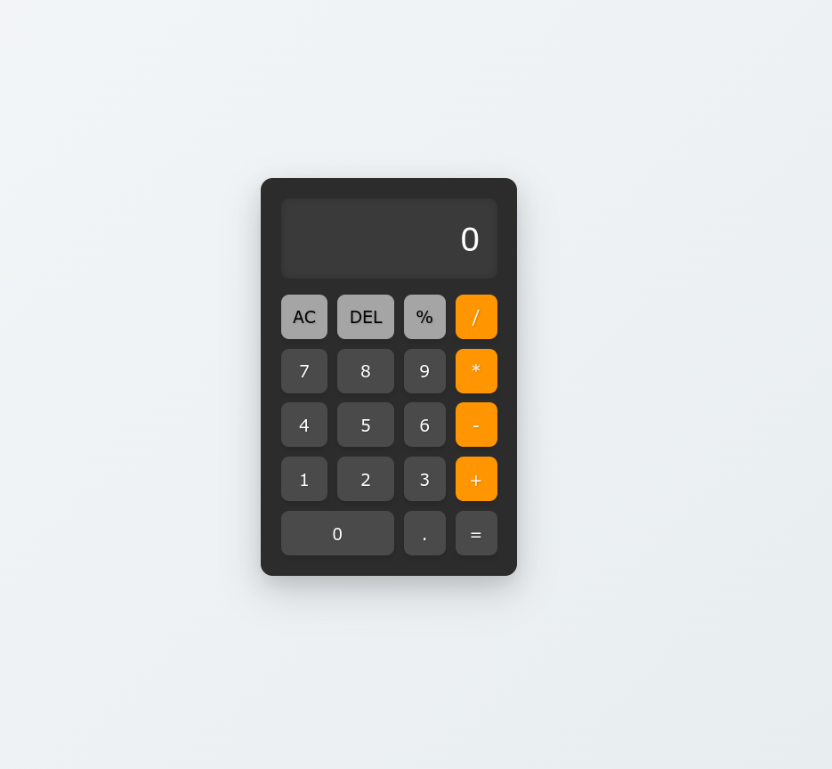

# odin-calculator
This is a responsive web-based calculator built using HTML, CSS, and JavaScript. The calculator supports basic arithmetic operations and provides both mouse and keyboard input functionality.

[Live Demo](https://trishan0.github.io/odin-calculator/)

## Features 
- Basic arithmetic operations (+, -, *, /)
- Clear (AC) and delete (DEL) functionality
- Responsive design
- Keyboard support
- Simple and intuitive user interface

  

    

      
    

  

  
